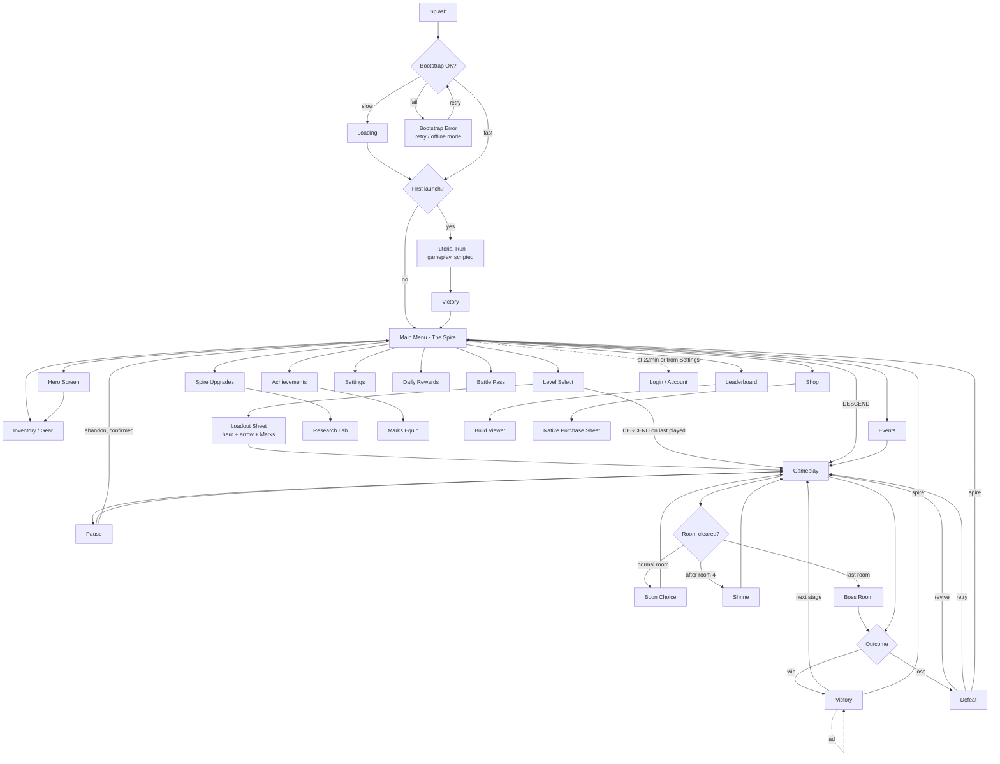

# 11 — Screen Flow

## 11.1 The full navigation graph

## 11.2 Navigation rules

1. **Every screen except Splash, Loading, and Gameplay has a back affordance**, and the Android
   hardware back button maps to it identically. Gameplay's back button opens Pause.
2. **The back stack never exceeds depth 3.** Deep-linking into Research Lab from a notification
   pushes `Menu → Spire → Research`, not a 6-deep chain.
3. **Gameplay is never popped implicitly.** Leaving a run always requires an explicit confirmed
   Abandon, or death. An ad, a push notification, a phone call, or an app backgrounding all
   auto-pause and resume in place.
4. **No screen may open a modal over Gameplay** except Pause, Boon Choice, and Shrine. Offers,
   rate prompts, and event announcements queue and fire on the next Menu visit.
5. **Victory → Next Stage skips the menu entirely.** The fastest path is run → run → run, and
   nothing is allowed between them except the Victory screen itself.

## 11.3 The critical paths

These four flows are measured on every build; regressions in tap count or latency block release.

| Path | Taps | p95 latency budget |
|---|---|---|
| Cold launch → in a run | **2** (open app, DESCEND) | 3.2 s to interactive |
| Victory → next run | **1** | 900 ms |
| Menu → buy a Spire upgrade → back to a run | **4** | — |
| Defeat → retry same stage | **1** | 900 ms |

## 11.4 Interrupt handling

| Interrupt | Behaviour |
|---|---|
| App backgrounded mid-run | Auto-pause, full run state snapshot to disk within 120 ms |
| App killed mid-run | On next launch, offer to resume from the last completed room |
| Phone call | Auto-pause, audio ducked, resumes paused |
| Rewarded ad | Auto-pause, resumes at the exact frame; ads only offered between rooms |
| Cloud save conflict | Resolution sheet on Menu, showing both saves with timestamps and progress; player chooses. Never silent |
| Network loss | Silent. Game continues fully offline; a small cloud icon greys out |
| Purchase interrupted | Native sheet handles it; on relaunch, pending purchases are reconciled before the Menu renders |

## 11.5 Routing contract

Named routes with typed arguments, `go_router`, one declaration file
(`lib/core/routing/app_router.dart`).

| Route | Args | Guard |
|---|---|---|
| `/` | — | — |
| `/loading` | — | — |
| `/menu` | — | bootstrap complete |
| `/levels/:chapter` | `chapter` | chapter unlocked |
| `/loadout` | `StageRef` | stage unlocked, Vigor sufficient |
| `/game` | `RunConfig` | **run not already active** |
| `/spire` | `wing?` | — |
| `/spire/research` | — | account level ≥ 9 |
| `/heroes` | `heroId?` | — |
| `/gear` | `tab?` | — |
| `/shop` | `tab?` | — |
| `/compete` | `board?` | signed in for global |
| `/events/:eventId` | `eventId` | event live |
| `/pass` | — | — |
| `/achievements` | `tab?` | — |
| `/settings` | — | — |
| `/daily` | — | — |

**Deep links** (push notifications, share links): `quiverfall://event/{id}`,
`quiverfall://daily`, `quiverfall://build/{code}`. Every deep link resolves through the same
guards; an invalid or expired link lands on `/menu` with an explanatory toast rather than a
crash or a blank screen.

**The `/game` guard is load-bearing.** A double-tap on DESCEND, a deep link arriving during a
run, or a race between the resume prompt and a fresh launch must never produce two live
`GameSession` objects. The guard is backed by a single-flight lock in `RunCoordinator`, and it
has a regression test.
